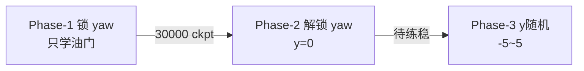

# Stage-2 接敌训练交接文档

> 课程大作业：Simple vs 固定靶机，PPO 在线 combat。  
> 代码目录：`Reinforcement-learning-drone/`  
> 最后更新：2026-06-30  
> **新开对话可说：「按 STAGE2_会话总结 继续 Phase-2/3」**

---

## 1. 总体路线（当前采用）

**放弃 Stage-1→Stage-2 续训**（易右拐/甩头），改 **combat 三阶段课程，从零 Phase-1 开始**：



| 阶段 | env + alg | 锁定 | 自由动作 | 状态 |
|------|-----------|------|----------|------|
| **P1** | `envs.stage2.phase1.yaml` + `algs.stage2.phase1.yaml` | roll/pitch/yaw | 油门（`max_throttle:0.35`） | ✅ **稳定击杀** |
| **P2** | `envs.stage2.phase2.yaml` + `algs.stage2.phase2.yaml` | roll/pitch | 油门+yaw | ⚠️ **左拐、几乎无击杀**（见 §6） |
| **P3** | `envs.stage2.phase3.yaml` + `algs.stage2.phase3.yaml` | roll/pitch | 油门+yaw + y随机 | 未开始 |

---

## 2. UE 房间（每次训练前改 yaml）

| 项 | 当前值 |
|----|--------|
| host | `10.119.14.141` |
| port | **1000** |
| room_id | **20051**（曾用 19988、20042） |
| 比赛轮数 | ≥ 总步数÷512（Phase-2 80k → 至少 ~160 轮） |

---

## 3. 环境与动作（三阶段共用基线）

### 3.1 几何

```
我方: (0, 0, 100)   高度 1000 m
敌方: (120, y, 100)  前方 1200 m
初速: initial_speed=10 → 100 m/s
P1/P2: enemy_y_range: [0, 0]
P3:    enemy_y_range: [-5, 5]
```

### 3.2 截停

```yaml
terminate_on_overshoot: true
overshoot_margin_m: 30.0   # 前向距靶 < 30m 即 truncated（正值）
```

- 负值（如 -150）= 飞过靶后再飞 |margin| 米才停（曾用于调试，已改回 30）
- overshoot 日志示例：
  ```
  [combat overshoot] step=175 speed=187m/s my_x=1057m enemy_hp=0.920 min_hp=0.920 fwd=30m margin=30m
  ```

### 3.3 动作映射（`utils/action.py`）

| 网络维 | 真实控制 | 映射 |
|--------|----------|------|
| action[0] throttle | [0, max_throttle] | `(a+1)/2 * max_throttle` |
| action[1] pitch | [-1,1] | lock 或 `a*scale` |
| action[2] roll | [-1,1] | lock 或 `a*scale` |
| action[3] yaw | [-1,1] | lock 或 `a*scale`（**无 max_yaw，待加**） |

当前 yaml：

```yaml
action:
  lock_throttle: false
  max_throttle: 0.35      # 油门上限，非 lock
  lock_roll: true
  lock_pitch: true
  fixed_pitch: 0.0
  lock_yaw: true/false    # P1 true, P2/P3 false
  fixed_yaw: 0.0          # P1 锁时恒 0
  action_scale: 0.4       # pitch/roll/yaw 有效幅度 ±0.4
```

**油门 vs 锁油门**：`lock_throttle` 完全忽略 PPO；`max_throttle` 仍让 PPO 在 `[0, 0.35]` 内学习。

**simple_dynamics 要点**：油门 0 = 无推力、**不是刹车**；靠惯性滑行。减速 = 提前收油。

---

## 4. 奖励（`utils/reward.py` 当前版）

### 4.1 相对旧版的重要改动

| 改动 | 说明 |
|------|------|
| `enemy_damage` | 敌 HP 下降即 +8/命中，**与攻击盒无关** |
| `distance_progress` | `/150`，cap **±0.5**（削弱猛冲） |
| `speed_penalty` | 靶前 **1200m** 内，期望速度 `max(50, fwd/4)` m/s |
| `attack_speed_penalty` | 攻击盒内 >250 m/s 重罚 |
| `overshoot` | 与 yaml `overshoot_margin_m` 对齐 |
| 移除 | 旧 `finish_speed_penalty` |

### 4.2 攻击几何

- 前向 **60–660 m**，横向 **±10 m**
- Simple HP：**0~1**，每 hit **~0.01**，击杀需 ~100 次命中
- 满速飞越攻击区步数少 → 必须控速（`max_throttle` + 速度惩罚）

---

## 5. Phase-1 结果（✅ 过关）

### 5.1 推荐 checkpoint

**`model/stage2_phase1/ppo_combat_p1_30000_steps.zip`**

### 5.2 Eval（3 局 deterministic，初速 10 + max_throttle 0.35）

```powershell
python scripts/eval_policy.py --model ./model/stage2_phase1/ppo_combat_p1_30000_steps.zip --env-config ./config/envs.stage2.phase1.yaml --episodes 3 --log-interval 40
```

| 指标 | 结果 |
|------|------|
| 击杀 | **3/3** |
| 步数 | ~175 步/局 |
| 油门 | **0.11~0.12**（收油接敌） |
| 总奖励 | ~2710/局 |

### 5.3 训练命令

```powershell
python main.py --env-config ./config/envs.stage2.phase1.yaml --config ./config/algs.stage2.phase1.yaml
tensorboard --logdir ./logs/stage2_phase1/
```

- 总步数 60k，ckpt 每 5k：`ppo_combat_p1_*_steps.zip`
- 曾用 `initial_speed: 6` 练稳后再改回 **10**，eval 仍 3/3 击杀

---

## 6. Phase-2 现状（⚠️ 问题未解）

### 6.1 启动

```powershell
python main.py --env-config ./config/envs.stage2.phase2.yaml --config ./config/algs.stage2.phase2.yaml
tensorboard --logdir ./logs/stage2_phase2/
```

- 续训：`load_path: ./model/stage2_phase1/ppo_combat_p1_30000_steps.zip`
- 日志：`logs/stage2_phase2/monitor.csv`、`progress.csv`

### 6.2 现象

- **目视：自然向左拐**，像行为收敛
- **训练 rollout：0 击杀**（`kill_bonus_mean=0` 全程）
- `ep_rew_mean`：2652（iter1）→ **~480**（~55k 步）
- overshoot 时 `enemy_hp≈0.92`，几乎无伤害

### 6.3 数据分析结论（`logs/stage2_phase2/`）

| 信号 | 表现 | 解读 |
|------|------|------|
| `alignment_mean` | ~1.76 仍高 | 机头大致朝敌 |
| **`attack_box_mean`** | **iter2 起恒负（-0.84~-1.35）** | 不在可攻击带（横向偏出 ±10m） |
| `kill_bonus_mean` | 0 | 无击杀 |
| `train/std` | ~0.367 不变 | 探索噪声未减 |
| `policy_gradient_loss` | ~0.0003 | **几乎不学** |

### 6.4 左拐根因（离线测权重，不连 UE）

Phase-1 **锁 yaw** 时 `action[3]` 不参与环境，但该维权重仍存在：

| ckpt | action[3] yaw（det / stoch mean） |
|------|-----------------------------------|
| P1 30000 | **-0.112 / -0.096** |
| P2 55000 | **-0.085 / -0.060** |

解锁后：`real_yaw ≈ action[3]×0.4 ≈ -0.04` 常偏 + 噪声 → 平台侧表现为**持续左舵**（负 yaw = 左，与观感一致）。  
Phase-2 **未纠正**该偏置，反而 `attack_box` 长期负、无 kill 信号 → 梯度弱 → 像「收敛到坏策略」。

### 6.5 待做（新对话优先）

1. **加 `max_yaw: 0.15~0.2`**（类比 `max_throttle`，改 `action.py` + yaml）
2. **Phase-2 前几 k 步继续 lock_yaw**，再解锁
3. 加大横向惩罚 / `turn_penalty`
4. 或 **Phase-2 从零只训 yaw**（锁油门为 eval 均值 ~0.12，只开 yaw 维）
5. eval 时看 `act[3]` 与 `my_state[5]`（`scripts/eval_policy.py` 已用 `env._marshal_action` 打真实油门）

---

## 7. Phase-3（未开始）

```powershell
python main.py --env-config ./config/envs.stage2.phase3.yaml --config ./config/algs.stage2.phase3.yaml
```

- 默认 `load_path: ./model/stage2_phase2/ppo_combat_p2_final.zip` → **需等 P2 有可用 ckpt 再改**
- `enemy_y_range: [-5, 5]`

---

## 8. 代码改动清单（相对原始 Stage-2）

| 文件 | 改动 |
|------|------|
| `utils/action.py` | `lock_yaw`/`fixed_yaw`；**`max_throttle`** |
| `utils/reward.py` | 速度惩罚、`speed_penalty`/`attack_speed_penalty`；削弱 `distance_progress`；`overshoot_margin_m` 参数 |
| `envs/train_env.py` | 传 `max_throttle`/`lock_yaw`；combat overshoot 日志（speed/x/hp/min_hp/fwd）；`enemy_hp` reset 日志 |
| `config/envs.stage2.phase*.yaml` | 三阶段 env |
| `config/algs.stage2.phase*.yaml` | 三阶段 PPO |
| `scripts/eval_policy.py` | 日志用 `env._marshal_action`（含 max_throttle） |

**尚未实现**：`max_yaw`、Phase-2 分步解锁 yaw。

---

## 9. 常用命令

```powershell
cd Reinforcement-learning-drone
..\venv\Scripts\Activate.ps1

# 训练
python main.py --env-config ./config/envs.stage2.phase1.yaml --config ./config/algs.stage2.phase1.yaml

# Eval
python scripts/eval_policy.py --model ./model/stage2_phase1/ppo_combat_p1_30000_steps.zip --env-config ./config/envs.stage2.phase1.yaml --episodes 3

# 单测
python -m unittest tests.test_action_observation tests.test_reward_initialize_truncate -v

# TensorBoard
tensorboard --logdir ./logs/stage2_phase1/
```

**注意**：eval 与 train **不能同占一个 room**；eval 前停训练或换 room。

---

## 10. 相关文档

| 文件 | 内容 |
|------|------|
| `TRAINING_总结.md` | 全局训练总结（含 Stage-1 历史） |
| `STAGE1_会话总结.md` | Stage-1 对准详细交接 |
| **本文** | Stage-2 三阶段 + P1 成果 + P2 左拐问题 |

---

## 11. 一句话状态

**Phase-1 用「max_throttle 0.35 + 速度惩罚 + 削弱 distance_progress」在 30000 步 ckpt 上 eval 稳定击杀；Phase-2 解锁 yaw 后因 P1 未训 yaw 维的负偏置导致左拐、attack_box 长期负、无击杀，需 max_yaw 或分阶段解锁后再训。**
