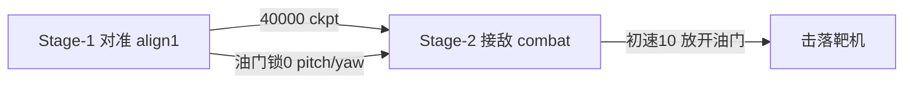

# 无人机 RL 训练总结（Stage-1 → Stage-2）

> 课程大作业：Simple vs 固定靶机，PPO 在线训练。  
> 代码目录：`Reinforcement-learning-drone/`  
> 最后更新：2026-06-30  
> **Stage-2 三阶段详细交接见 [`STAGE2_会话总结.md`](STAGE2_会话总结.md)**

---

## 1. 总体路线



| 阶段 | stage | 任务 | 奖励 | 动作 |
|------|-------|------|------|------|
| **Stage-1** | `align1` | 对准 LOS 并保持 hold | `reward_align.py` | 油门/roll 锁定，pitch+yaw |
| **Stage-2** | `combat` | 带速接敌、进入攻击、扣血/击落 | `reward.py` | roll/pitch 锁定，油门+yaw |

---

## 2. 平台与物理（必读）

| 量 | 约定 |
|----|------|
| 位置 | **1 unit = 10 m** |
| 速度 | **1 unit/s = 10 m/s**（初始包 `[10,0,0]` → 100 m/s） |
| 角度 | roll/pitch/yaw、角速度均为 **弧度** |
| HP（Simple 在线） | **0~1** 浮点，满血 `1.0`，典型命中 `-0.01` |
| 初始包 yaw | **int32**，`0`=机头朝 +x；不要用 degrees/mrad |
| 固定靶 enemy 观测 | 常为 `(0,0,0)` → reset 时 `set_enemy_fallback_position()` 对齐真实敌位 |
| 局间收尾 | 结束须向 UE 发 **truncation=1**（`_send_finish_round()`），否则下局初始姿态脏 |

**攻击几何（reward 用）：** 前向距离 60–660 m，横向 ±10 m 为严格攻击盒；Stage-2 扣血奖励已改为 **只看 HP 下降**，不再依赖攻击盒。

---

## 3. Stage-1 对准（align1）

### 3.1 目标

- 从略带偏差姿态对准靶机视线（≤ 阈值角），连续 hold 若干步即成功。
- 不追击、不开火、油门恒 0。

### 3.2 最终配置（v3）

文件：`config/envs.stage1.yaml` + `config/algs.stage1.yaml`

```
我方: (0, 0, 100)     高度 1000 m，速度 0
敌方: (120, y, 100)   前方 1200 m
yaw: 0（int32）
y 随机: [-10, 10]     最大角差 ~4.8°（v3）；曾用 [-8,8]、[-5,5]
对准阈值: 2.5°
```

**Hold 课程（无上限）：**

- 起始 required hold = **8** 步；每成功 **5** 局 → required **+2**
- 成功奖励 = `10 × required_hold`（8 步→80，10 步→100 …）
- 成功 → `terminated` + finish_round

**动态超时（训练用，后已弃用于 eval）：**

- `step > hold_count + 100` → truncated（省无效步数）

### 3.3 PPO（stage1 v3）

| 项 | 值 |
|----|-----|
| timesteps | 80k |
| ent_coef | 0.001 |
| clip_range | 0.1 |
| log_std_init | -1.0 |
| action_scale | 0.35 |
| 日志/模型 | `logs/stage1_align_v3/`、`model/stage1_align_v3/` |

### 3.4 训练结论

- **最佳 ckpt：`ppo_align1_v3_40000_steps.zip`**（eval 512 步、无 hold 截停时 mean max_hold≈42.7）
- 50k–70k 段 hold 课程涨到 ~68 步后成功率崩溃；80000/final 仅部分恢复
- 现象：能间歇性对准，但随机策略 std≈0.37 导致「对准后又甩头」

### 3.5 启动

```powershell
python main.py --env-config ./config/envs.stage1.yaml --config ./config/algs.stage1.yaml
tensorboard --logdir ./logs/stage1_align_v3/
```

---

## 4. Stage-2 接敌（combat）

### 4.1 目标（助教口径）

- 几何与 Stage-1 一致：**`(0,0,100)` → `(120, y, 100)`**
- 初速 **10 unit = 100 m/s**（助教建议 10–20，取 10）
- 先 **固定 y=0** 正对靶练打中；稳定后再恢复 y 随机
- **飞过靶机即截停**（不学绕飞回来打）
- 同高度作战 → **锁 pitch**

### 4.2 当前配置

文件：`config/envs.stage2.yaml` + `config/algs.stage2.yaml`

```yaml
# envs.stage2.yaml（摘录）
stage: combat
stage_params:
  initial_speed: 10
  altitude_unit: 100
  enemy_pos: [120, 0, 100]
  enemy_y_range: [0, 0]      # 暂固定；可改 [-5, 5]
  max_steps_per_episode: 512
  terminate_on_overshoot: true

action:
  lock_throttle: false       # 放开油门
  max_throttle: 1.0           # 可选：油门上限 (0,1]，Phase-1 常用 0.35
  lock_roll: true
  lock_pitch: true           # 保持高度
  fixed_pitch: 0.0
  action_scale: 0.4
```

```yaml
# algs.stage2.yaml（摘录）
load_path: ./model/stage1_align_v3/ppo_align1_v3_40000_steps.zip
total_timesteps: 100000
reset_num_timesteps: false
learning_rate: 1.0e-4
ent_coef: 0.002
vf_coef: 0.5
```

**UE 房间（训练前改）：** `port: 1000`，`room_id: 19988`；比赛轮数 ≥200，最大回合 512。

### 4.3 续训

```powershell
python main.py --env-config ./config/envs.stage2.yaml --config ./config/algs.stage2.yaml
# 或显式：
python main.py ... --load ./model/stage1_align_v3/ppo_align1_v3_40000_steps.zip

tensorboard --logdir ./logs/stage2_combat/
```

### 4.4 局结束条件

| 条件 | 行为 |
|------|------|
| UE 报 enemy HP=0 | `terminated` + kill_bonus +300 |
| 飞过靶机（前向距离 < margin） | `truncated` + overshoot -8 + finish_round |
| 步数 ≥ 512 | `truncated` + finish_round |
| 坠地 / 分离 >5000 m | `truncated`（truncate.py） |

---

## 5. 奖励函数

### 5.1 Stage-1（`utils/reward_align.py`）

| 分项 | 说明 |
|------|------|
| cosine | `5×(cos+1)/2`，单调随对准变好 |
| cosine_progress | 本步比上步 cos 提高则加分 |
| tight / hold | 进入阈值角内才有 |
| success_bonus | `10 × required_hold`（成功局） |
| timeout_penalty | 动态超时 -1.5 |

### 5.2 Stage-2（`utils/reward.py`）

**Shaping（每步）：**

| 分项 | 量级/条件 |
|------|-----------|
| distance_progress | 接近敌机 ±0.5 上限（/150m 缩放，削弱猛冲激励） |
| alignment | `2×cos`，约 +1.8 当对准好 |
| attack_box | 严格盒内才有正分，盒外约 -1 |
| corridor / centerline | 对准 × 横向误差衰减 |
| proximity | ~+0.08 |
| survival | **-0.02/步** |
| overshoot | 飞过靶 **-8** |
| finish_centerline | 靶前 600 m 内对准加分 |
| speed_penalty | 靶前 600 m：超速相对 `fwd/4` 连续惩罚 |
| attack_speed_penalty | 攻击盒内 >300 m/s 重罚 |

**稀疏：**

| 分项 | 值 |
|------|-----|
| **enemy_damage** | **敌机 HP 下降即 +8/命中**（与攻击盒无关） |
| enemy_hp_shaping | HP 下降 × 4（辅助，较小） |
| kill_bonus | +300 |
| death_penalty | -300 |

> **重要变更：** 早期 `enemy_damage` 必须在攻击盒内才给分，导致 UE 扣血但 TensorBoard `enemy_damage_mean=0`。已改为 **直接读 HP 差**，任意命中都有 +8 反馈。

---

## 6. 动作映射（`utils/action.py`）

| 网络输出 | 真实控制 | Stage-1 | Stage-2 |
|----------|----------|---------|---------|
| action[0] throttle | [0,1] | 锁定 0 | 放开 |
| action[1] pitch | [-1,1] | scale×0.35 | **锁定 0** |
| action[2] roll | [-1,1] | 锁定 0 | 锁定 0 |
| action[3] yaw | [-1,1] | scale×0.35 | scale×0.4（P1 可 lock_yaw） |

---

## 7. Eval 与 checkpoint

**Stage-1 批量 eval：** `scripts/eval_align_ckpts.py`

- 不做 hold 截停，统计 max_hold
- 每 ckpt 3 局，含 final
- 512 步/局，random y（config 决定）
- 输出：`logs/stage1_align_v3/eval_ckpts_512.csv`

**Stage-1 推荐 ckpt：** `model/stage1_align_v3/ppo_align1_v3_40000_steps.zip`

---

## 8. 踩坑清单

| 现象 | 原因 | 处理 |
|------|------|------|
| 扣血但 damage_mean=0 | 旧 reward 要求攻击盒内才给 damage | 已改 HP 直反馈 |
| eval 初始角差 30°~90° | 局间未 finish_round，UE 状态脏 | step 末 `_send_finish_round()` |
| 一直往右上拐 | y>0 需右转 + Stage-1 习惯 pitch 上 + 100m/s | 锁 pitch、固定 y=0 |
| 有伤害但难击杀 | 100 m/s 飞越攻击区步数少 + 每 hit 仅 -0.01 HP | 加强近距减速奖励；`overshoot_margin_m: -150` 放宽截停 |
| hold 68 步后成功率归零 | 课程过难 + 探索噪声 | Stage-1 停训，用 40000 ckpt |
| alignment_cos AttributeError | combat 无此函数 | `_alignment_cos()` 分支 |
| 第二局断连 | UE 比赛轮数不够 | 轮数 ≥ 总步数/512 |

---

## 9. 关键文件

| 文件 | 作用 |
|------|------|
| `config/envs.stage1.yaml` | Stage-1 环境 |
| `config/algs.stage1.yaml` | Stage-1 PPO |
| `config/envs.stage2.yaml` | Stage-2 环境（旧续训路线） |
| `config/algs.stage2.yaml` | Stage-2 续训 PPO |
| `config/envs.stage2.phase*.yaml` | Stage-2 三阶段课程 env |
| `config/algs.stage2.phase*.yaml` | Stage-2 三阶段课程 PPO |
| `utils/initialize_align.py` | Stage-1 初始化 |
| `utils/initialize.py` | Stage-2 combat 初始化 |
| `utils/reward_align.py` | Stage-1 奖励 |
| `utils/reward.py` | Stage-2 奖励 |
| `envs/train_env.py` | Gym 主循环、hold 课程、overshoot 截停 |
| `main.py` | 训练入口，`--load` 续训 |
| `scripts/eval_align_ckpts.py` | Stage-1 ckpt 批量 eval |
| `STAGE1_会话总结.md` | Stage-1 详细交接（历史） |

---

## 10. 后续建议

### 10.1 Stage-2 三阶段课程（推荐：跳过 Stage-1，从零练 combat）

**动机：** 从 Stage-1 续训时战机易「总往右拐」——Stage-1 只练 yaw/pitch 对准，续到 combat 后 yaw 噪声 + 侧向靶 y>0 需右转，形成错误倾向。改从零在 combat 里分步解锁自由度。

| 阶段 | 配置 | 固定/锁定 | 自由动作 | 目标 |
|------|------|-----------|----------|------|
| **P1** | `envs.stage2.phase1.yaml` + `algs.stage2.phase1.yaml` | y=0，锁 roll/pitch/yaw | **仅油门** | 正对靶直线接敌，学扣血/击杀节奏 |
| **P2** | `envs.stage2.phase2.yaml` + `algs.stage2.phase2.yaml` | y=0，锁 roll/pitch | 油门+yaw | 在 P1 ckpt 上解锁转向 |
| **P3** | `envs.stage2.phase3.yaml` + `algs.stage2.phase3.yaml` | 锁 roll/pitch | 油门+yaw | y∈[-5,5] 泛化 |

**启动命令：**

```powershell
# Phase-1（从零，约 60k 步；看 enemy_damage_mean 是否稳定 >0）
python main.py --env-config ./config/envs.stage2.phase1.yaml --config ./config/algs.stage2.phase1.yaml
tensorboard --logdir ./logs/stage2_phase1/

# Phase-2（续 P1 final；默认 load_path 已指向 p1_final）
python main.py --env-config ./config/envs.stage2.phase2.yaml --config ./config/algs.stage2.phase2.yaml
tensorboard --logdir ./logs/stage2_phase2/

# Phase-3（续 P2 final；恢复 y 随机）
python main.py --env-config ./config/envs.stage2.phase3.yaml --config ./config/algs.stage2.phase3.yaml
tensorboard --logdir ./logs/stage2_phase3/
```

**切换 ckpt：** 若 P1 中途某步（如 40000）更好，Phase-2 用 `--load ./model/stage2_phase1/ppo_combat_p1_40000_steps.zip`。

**P1 过关信号：** TensorBoard `enemy_damage_mean` 出现稳定尖峰；偶发 `kill_bonus` 更佳。仍大量 overshoot → 可短期 `lock_throttle: true` 或降 `initial_speed: 8`。

**代码：** `action.lock_yaw` / `fixed_yaw` 已加入 `utils/action.py`，env yaml 里 `lock_yaw: true` 即可。

### 10.2 旧路线（Stage-1 → Stage-2 续训）

1. **Stage-2 先练稳 y=0**：看 `enemy_damage_mean` 是否出现尖峰。
2. **有伤害后**恢复 `enemy_y_range: [-5, 5]`。
3. 仍 overshoot 多 → 略降 `initial_speed: 8` 或短期锁油门。
4. 能打中后 → 略收紧 alignment / 加大 kill_bonus 权重做 finetune。
5. 写报告时可引用：Stage-1 课程 hold、40000 eval、Stage-2 助教几何与 HP 直反馈 reward。

---

*新开对话可说：「按 TRAINING_总结 继续 Stage-2」或「恢复 y 随机」。*
