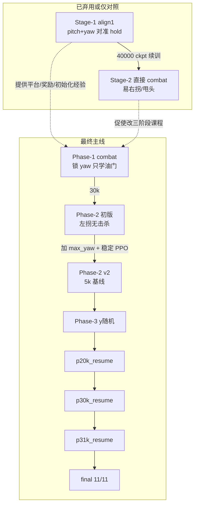

# 课程大作业第一题总结（完整版）

> **题目**：在 `simple_dynamics` 下控制油门、俯仰、滚转、偏航，击落 ≥1000 m 处固定靶机。  
> **算法**：PPO（Stable-Baselines3）  
> **动力学**：simple_dynamics（combat 阶段）  
> **定稿模型**：`model/stage2_phase3_p31k_resume/ppo_combat_p3_p31k_resume_final.zip`  
> **代码目录**：`Reinforcement-learning-drone/`  
> **最后更新**：2026-06-30  
> **合并自**：`STAGE1_会话总结.md`、`STAGE2_会话总结.md`、`STAGE2_P3_会话总结.md`、`TRAINING_总结.md`

---

## 目录

1. [题目要求对照](#1-题目要求对照)  
2. [思路演变总览（报告核心）](#2-思路演变总览报告核心)  
3. [阶段一：Stage-1 对准（align1）](#3-阶段一stage-1-对准align1)  
4. [阶段二：Stage-1 → Stage-2 直接续训（已弃用）](#4-阶段二stage-1--stage-2-直接续训已弃用)  
5. [阶段三：Combat 三阶段课程（最终主线）](#5-阶段三combat-三阶段课程最终主线)  
6. [阶段四：P2 v2 改造与 P3 泛化](#6-阶段四p2-v2-改造与-p3-泛化)  
7. [阶段五：短续训与「峰值早停」范式](#7-阶段五短续训与峰值早停范式)  
8. [定稿设计与实现细节](#8-定稿设计与实现细节)  
9. [Eval 结果演进](#9-eval-结果演进)  
10. [Checkpoint 索引](#10-checkpoint-索引)  
11. [踩坑清单](#11-踩坑清单)  
12. [实验心得与报告可写要点](#12-实验心得与报告可写要点)  
13. [常用命令](#13-常用命令)  
14. [相关文档](#14-相关文档)

---

## 1. 题目要求对照

| 要求 | 本方案 |
|------|--------|
| 初始间距 ≥ 1000 m | `(0,0,100)` → `(120,y,100)` = **1200 m**（1 unit = 10 m） |
| 不能仅用油门 | **油门 + yaw**；roll / pitch 锁定 |
| 控制量可取舍 | 分阶段解锁（P1 只油门 → P2 加 yaw → P3 加 y 随机） |
| 分段训练 | 见 §2 思路演变 |
| simple_dynamics | combat 全程 |
| 展示用训练完智能体 | `ppo_combat_p3_p31k_resume_final.zip` + §13 eval |

---

## 2. 思路演变总览（报告核心）

本题的求解不是「一次训到底」，而是 **五条路线迭代、三次范式转变**。下图概括最终采用的路线；虚线表示尝试过但放弃或仅作对照。



### 2.1 三次范式转变

| 次序 | 从 | 到 | 触发原因 |
|------|----|----|----------|
| **① 任务分解** | 四维同训 / 先对准再 combat | **Combat 内分 P1/P2/P3 解锁动作** | Stage-1 续 combat 转向习惯错误；四维样本效率低 |
| **② 奖励与信号** | damage 须在攻击盒内 | **HP 下降即给分** + 速度/overshoot  shaping | TensorBoard `enemy_damage_mean=0` 但 UE 已扣血 |
| **③ 训练节奏** | 长训 40k~80k 步 | **短续训 + 1k 存盘 + y 扫点 eval + 峰值早停** | 续训前 1k~3k 最好，之后左偏坍缩至 -10°~-15° |

### 2.2 思路变化时间线（便于写报告「设计过程」）

| 时期 | 想法 | 结果 | 下一步决策 |
|------|------|------|------------|
| **Stage-1 早期** | 30° 圆锥 + setup 摆姿态 | 平台不吃错误角度编码 | 放弃 setup，搞清 int32 yaw |
| **Stage-1 中期** | yaw=3 背对靶 | 不符合「正对接敌」展示 | 改 yaw=0 + 敌 y 偏移 |
| **Stage-1 后期** | pitch/yaw 对准 + hold 课程至 68 步 | 40000 ckpt 最好，后期 hold 过难崩溃 | 保留作子任务经验，**不直接续 combat** |
| **Stage-2 旧路线** | align1@40k → combat 续训，放开油门 | 易「往右拐」、甩头 | **放弃续训，combat 从零 P1** |
| **P1** | 锁 yaw，只学油门 + 控速 | 30k **3/3 击杀**，油门 ~0.12 | 进入 P2 解锁 yaw |
| **P2 初版** | 解锁 yaw，lr=1e-4，无 max_yaw | **0 击杀**，持续左拐，attack_box 恒负 | 分析为 P1 遗留 action[3] 负偏置 |
| **P2 v2** | +max_yaw 0.15、yaw 惩罚、lr 5e-5、n_epochs 3 | **5k ckpt 最稳**，后续步数退化 | 以 5k 进 P3 |
| **P3 首轮** | y∈[-5,5] 均匀随机 | 20k **+1 击杀**；25k~30k 左偏加重 | y 扫点 eval 发现 -y 易 +y 难 |
| **p20k_resume** | 首次 +y 偏置 0.78 | 30k +2 几乎击杀 | 确认「初期好、后期崩」 |
| **p30k_resume** | 1k 存盘，从 30k 短续 | **31k = 8/11（+2 击杀）** | 35k 起 K=3 崩溃 |
| **p31k_resume** | lr 1e-5、n_epochs 1、clip 0.04 | **final = 11/11 击杀** | **定稿，准备录像与报告** |

### 2.3 设计思想一句话演进

> **「先对准」→「先接敌再转向」→「先扣血再泛化侧向」→「短步微调、峰值即停」**

---

## 3. 阶段一：Stage-1 对准（align1）

> 详细交接：`STAGE1_会话总结.md`

### 3.1 当时的目标

- **任务**：机头对准靶机视线（LOS），连续保持 hold 若干步即成功。  
- **不做**：追击、开火、油门（恒 0）。  
- **动作**：锁 throttle/roll，学 **pitch + yaw**，`action_scale=0.35`。

### 3.2 初始化思路的演变

| 版本 | 方案 | 结论 |
|------|------|------|
| 初版 | 30° 圆锥 + `setup_orientation` | 角度编码错误 / 跑满 200 步 |
| 中间 | 根目录 `yaw=3` 背对 | 用户要求不要背对 |
| 中间 | `yaw=±1` 随机 | 与 y 组合复杂 |
| **定稿** | **`yaw=0`（int32）+ 敌 `y∈[-8,8]`** | 角差 0°~3.8°，无需 setup |

```
我方: (0, 0, 100)   高度 1000 m，速度 0
敌方: (120, y, 100) 前方 1200 m
yaw:  0（机头 +x）
```

### 3.3 奖励与成功条件（思路：单调对准 + 课程 hold）

- **对准阈值**：从 15° 逐步收紧到 **1°**（必须比初始最大角差 ~3.8° 更严）。  
- **hold 课程**：起始 8 步，每成功 3 局 +4 步，上限 40。  
- **奖励核心**：`cosine` 单调、`tight` 进阈值才有、`hold` 随保持步数增加、`success_bonus = 10×required_hold`。

### 3.4 训练结论（为何不再直接续 combat）

- **最佳 ckpt**：`ppo_align1_v3_40000_steps.zip`（512 步 eval mean max_hold≈42.7）。  
- **50k~70k**：hold 涨到 ~68 步后成功率崩溃；80000/final 仅部分恢复。  
- **现象**：能对准但 **std≈0.37 随机策略易「甩头」**。  
- **对第一题的最终影响**：Stage-1 提供了 **平台约定、obs/reward 工程经验、y 偏移初始化**，但 **Stage-1→combat 续训因转向习惯不匹配而放弃**（见 §4）。

---

## 4. 阶段二：Stage-1 → Stage-2 直接续训（已弃用）

> 详细记录：`TRAINING_总结.md` §4、§8

### 4.1 当时的想法

- 几何与 Stage-1 一致，初速 **10 unit = 100 m/s**，从 align1@40k **续训 combat**。  
- 锁 pitch（同高度），放开油门，y 先固定为 0。

### 4.2 遇到的问题

| 现象 | 分析 |
|------|------|
| 总往 **右** 拐 | Stage-1 练 pitch/yaw 对准；combat 带 100 m/s + 侧向靶需不同转向逻辑 |
| 扣血但 `damage_mean=0` | 旧 reward 要求攻击盒内才给 damage（已在 combat 新代码中修复） |
| eval 初始角差 30°~90° | 局间未 `finish_round`，UE 状态脏 |
| 100 m/s 难击杀 | 飞越攻击区步数少，每 hit 仅 -0.01 HP |

### 4.3 决策：改为 Combat 内三阶段课程

**动机**（`TRAINING_总结.md` §10.1）：在 combat 任务本身里分步解锁，避免 Stage-1 的 pitch/yaw 习惯污染接敌策略。

| 阶段 | 锁定 | 自由 | 目标 |
|------|------|------|------|
| P1 | roll/pitch/**yaw** | 油门 | 正对靶直线接敌、扣血节奏 |
| P2 | roll/pitch | 油门+yaw | 在 P1 上学会转向 |
| P3 | roll/pitch | 油门+yaw | y 随机泛化 |

---

## 5. 阶段三：Combat 三阶段课程（最终主线）

> 详细交接：`STAGE2_会话总结.md`

### 5.1 Phase-1：只学油门（✅ 过关）

**配置**：`envs.stage2.phase1.yaml`，y=0，`lock_yaw=true`，`max_throttle=0.35`。

**奖励思路变化（相对 Stage-2 旧版）**：

| 改动 | 目的 |
|------|------|
| `enemy_damage` 只看 HP 差 | 与 UE 扣血一致 |
| 削弱 `distance_progress`（/150，cap ±0.5） | 防盲目全油门冲刺 |
| `speed_penalty` / `attack_speed_penalty` | simple_dynamics **无刹车**，靠收油控速 |
| `overshoot_margin_m: 30` | 飞过靶前截停，不学绕回 |

**结果**（eval 3 局）：

| 指标 | 值 |
|------|-----|
| 击杀 | **3/3** |
| 步数 | ~175 |
| 油门 | **0.11~0.12**（收油接敌） |
| ckpt | **`ppo_combat_p1_30000_steps.zip`** |

**隐性代价**：锁 yaw 时 **action[3] 无环境梯度**，权重漂移到 **-0.11 ~ -0.20**——成为 P2 左拐根因（当时未意识到，见 §6）。

### 5.2 Phase-2 初版：解锁 yaw（❌ 失败）

**配置**：`envs.stage2.phase2.yaml`，从 P1@30k 续训，`lr=1e-4`，**无 max_yaw**。

**现象**：

- 目视 **持续左拐**；rollout **0 击杀**；`ep_rew_mean` 2652 → ~480。  
- `alignment_mean` 仍高，但 **`attack_box_mean` 恒负**（横向偏出 ±10 m）。  
- 离线测：**action[3] ≈ -0.085**（det），与 P1 遗留偏置一致。

**当时的思路误区**：以为纯 reward / 探索不够；后证实 **主因是锁维度遗留偏置 + PPO 更新仍偏激进**。

---

## 6. 阶段四：P2 v2 改造与 P3 泛化

> 详细交接：`STAGE2_P3_会话总结.md`

### 6.1 P2 v2：动作与 PPO 的思路调整

**动作层**：

```yaml
max_yaw: 0.15          # 新增：类比 max_throttle，限制舵量
yaw_misalign_weight: 10.0   # 新增：-weight×(1-cos)
action_scale: 0.4
```

**PPO 层**（相对 P2 初版）：

| 参数 | P2 初版 | P2 v2 | 原因 |
|------|---------|-------|------|
| learning_rate | 1e-4 | **5e-5** | iter8 damage 高后 iter9 崩溃 |
| n_epochs | 5 | **3** | 减小过更新 |
| n_steps | 512/2048 | **768** | 折中采样量 |
| clip_range | 0.2 | **0.1** | 更稳 |

**结果**：**5000 steps** 在 y=0 上相对最稳，选作 P3 基线；后续步数并未持续变好。

### 6.2 Phase-3：y 随机与 +y 难题

**配置**：`enemy_y_range: [-5, 5]`，从 p2_v2@5000 续训。

**y 扫点 eval（p2_v2@5000 基线）**——第一次系统化看泛化：

| 区域 | 击杀 | final_yaw |
|------|------|-----------|
| y ≤ 0 | **6/6** | ~-6.4°~-7.4° |
| y > 0 | **0/5** | 仍 ~-6°（**不随 y 变向**） |

**思路转变**：

1. 左偏对 **-y 歪打正着**，对 **+y 致命**——不是 reward 不对称，是 **策略 yaw 与敌侧向无关**。  
2. 计划用 `enemy_y_positive_prob` 过采样 +y（**P3 首轮实际训练多为均匀 y**，偏置在后续 resume 才启用）。  
3. P3@20k 首次 **+1 击杀**；25k~30k 又左偏加重至 -15°。

**曾尝试又回退的 reward  tweak**：减半 alignment、damage 12、yaw 惩罚降到 6——效果不如稳定 PPO + 短续训。

---

## 7. 阶段五：短续训与「峰值早停」范式

这是定稿前 **最后一次思路转变**：接受「**不能长训，只能在峰值附近微调**」。

### 7.1 观察到的规律

| 续训轮次 | 起点 | 最好步数 | 之后现象 |
|----------|------|----------|----------|
| p20k_resume | P3@20k | ~30k | 35k yaw -10°，K=3 |
| p30k_resume | p20k@30k | **31k（8/11，+2 杀）** | 33k K=5，35k K=3 |
| p31k_resume | p30k@31k | **final（11/11）** | 32k 仍 7/11，34k 9/11 |

**共性**：续训 **前 1000~3000 步** 往往改善或维持；继续更新则 **左偏幅度增大**（-5° → -10° → -15°），击杀从 y≤0 蔓延到全线崩溃。

### 7.2 应对策略（最终采用）

| 手段 | 具体做法 |
|------|----------|
| **峰值 ckpt 短续** | 从 20k/30k/31k 等 eval 最好点重启，每次只训 5k~10k |
| **1k 存盘** | `save_freq: 1000`，便于在坍缩前截获 |
| **y 扫点 eval** | 11 个 y 各 1 局，指标：击杀数 K、+5 hp、final_yaw |
| **PPO 逐级保守** | lr 3e-5→2e-5→**1e-5**；n_epochs 3→2→**1**；clip 0.08→0.06→**0.04** |
| **+y 偏置** | 0.78→0.75→0.70，略降以防过拟合难样本 |
| **未采用但已实现** | `utils/policy_reset.py` 仅重置 yaw 输出层（保留油门） |

### 7.3 p31k_resume 定稿超参

```yaml
learning_rate: 1.0e-5
n_epochs: 1
clip_range: 0.04
target_kl: 0.015
ent_coef: 0.008
save_freq: 1000
load_path: p30k_resume_31000_steps.zip
```

---

## 8. 定稿设计与实现细节

### 8.1 Agent 与网络

| 项 | 定稿 |
|----|------|
| 算法 | PPO，`MlpPolicy` |
| 网络 | Actor/Critic **128-128**，Tanh |
| 观测 | **20 维**，`[-1,1]`（`utils/observation.py`） |
| 动作 | **4 维**网络输出 → `marshal_action` 映射 |

### 8.2 动作（定稿）

| 维 | 控制 | 定稿 |
|----|------|------|
| [0] throttle | [0, 0.35] | 学习 |
| [1] pitch | 0 | **锁定** |
| [2] roll | 0 | **锁定** |
| [3] yaw | ±0.15（×0.4 scale） | 学习 |

### 8.3 观测（20 维摘要）

相对位置、距离、双机视线 cos、速度/高度/HP 差、接近速度、我机姿态、攻击几何（前向距、横向误差、射程带）。  
敌 `(0,0,0)` 时用 `set_enemy_fallback_position([120,0,100])`。

### 8.4 奖励（定稿 combat）

**Shaping**：distance_progress（削弱）、alignment、yaw_misalign_penalty(10)、attack_box/corridor/centerline、speed/attack_speed 惩罚、overshoot(-8)、survival(-0.02/步)。

**稀疏**：`enemy_damage`（**HP 降即 +12/ hit**）、enemy_hp_shaping、kill_bonus/death_penalty(±300)。

**设计原则演变**：从「必须在攻击盒内才给 damage」→「**平台扣血即反馈**」；shaping 引导接敌，但不阻断 damage 信号。

### 8.5 终止与截断

- terminated：击杀 / 阵亡  
- truncated：512 步、overshoot（fwd < 30 m）、坠地/过远  
- **每局 `_send_finish_round()`**（truncation=1）

### 8.6 初始化（combat 定稿）

- 我机 `(0,0,100)`，初速 `[10,0,0]` → 100 m/s  
- 敌机 `(120,y,100)`，P3：`y∈[-5,5]`，可选 `enemy_y_positive_prob` 分侧采样

---

## 9. Eval 结果演进

### 9.1 y 扫点协议

- 脚本：`scripts/eval_stage2_phase3_by_y.py`  
- **y ∈ {-5,…,+5} 各 1 局 deterministic**  
- 主指标：**击杀数 K**、+5 `enemy_hp`、`final_yaw_deg`

### 9.2 关键节点对比

| 模型 | K | +2 hp | +5 hp | yaw(+1) | 备注 |
|------|---|-------|-------|---------|------|
| p2_v2@5000 | 6/11 | 0.33 | 0.86 | -7.4° | -y 全杀，+y 全挂 |
| P3@20k | 7/11 | 0.28 | 0.84 | -6.3° | 首次 +1 杀 |
| p20k@30k | 7/11 | **0.02** | 0.75 | -5.5° | +2 几乎杀 |
| p30k@**31k** | **8/11** | **0.00** | 0.75 | -5.5° | **+2 杀** |
| p30k@35k | 3/11 | 0.68 | 1.00 | -11.9° | 坍缩 |
| **p31k final** | **11/11** | **0.00** | **0.00** | **-3.1°** | **定稿** |

### 9.3 定稿 final 明细

| y | -5 | -4 | -3 | -2 | -1 | 0 | +1 | +2 | +3 | +4 | +5 |
|---|----|----|----|----|----|---|----|----|----|----|-----|
| enemy_hp | 0 | 0 | 0 | 0 | 0 | 0 | 0 | 0 | 0 | 0 | 0 |
| final_yaw_deg | -2.7 | -2.9 | -3.1 | -3.2 | -3.3 | -3.2 | -3.1 | -2.9 | -2.8 | -2.6 | -2.4 |

CSV：`logs/stage2_phase3_p31k_resume/eval/p31k_resume_all_by_y.csv`

---

## 10. Checkpoint 索引

| 路径 | 阶段 | 说明 |
|------|------|------|
| `model/stage1_align_v3/ppo_align1_v3_40000_steps.zip` | Stage-1 | 对准子任务（未用于 combat 续训） |
| `model/stage2_phase1/ppo_combat_p1_30000_steps.zip` | P1 | 油门接敌 |
| `model/stage2_phase2_v2/ppo_combat_p2_v2_5000_steps.zip` | P2 v2 | P3 起点 / +y 问题基线 |
| `model/stage2_phase3/ppo_combat_p3_20000_steps.zip` | P3 | 首次 +1 击杀 |
| `model/stage2_phase3_p30k_resume/ppo_combat_p3_p30k_resume_31000_steps.zip` | 短续 | 8/11 峰值 |
| **`model/stage2_phase3_p31k_resume/ppo_combat_p3_p31k_resume_final.zip`** | **定稿** | **11/11** |

---

## 11. 踩坑清单

| 现象 | 原因 | 处理 |
|------|------|------|
| 初始角 yaw 无效 | degrees/mrad 编码 | **int32 yaw**，y=0 + 敌 y 偏移 |
| setup 跑满 200 步 | 启发式与平台不同步 | **默认关 setup** |
| damage_mean=0 但 UE 扣血 | reward 要求攻击盒内 | **HP 差直反馈** |
| eval 初始角 30°~90° | 未 finish_round | `_send_finish_round()` |
| Stage-1→combat 右拐 | 对准习惯 vs 带速 combat | **改 P1/P2/P3 课程** |
| P2 左拐无击杀 | P1 lock yaw → action[3] 负偏置 | max_yaw + yaw 惩罚 + 短续训 |
| +y 不杀、-y 全杀 | 恒定左偏，非 reward 不对称 | y 扫点诊断；+y 过采样；峰值早停 |
| 续训越训越差 | PPO 过更新 | lr↓ epochs↓ clip↓ target_kl↓ 1k 存盘 |
| 第二局断连 | UE 比赛轮数不足 | 轮数 ≥ 总步数/512 |

---

## 12. 实验心得与报告可写要点

### 12.1 方法层面

1. **任务分解优于一次端到端**：第一题虽要求四维可控，但 **课程式解锁** 符合题目「分段训练」精神，且样本效率高。  
2. **子任务续训要谨慎**：Stage-1 对准与 combat 接敌的 **动作语义不同**，直接续训引入错误先验。  
3. **锁维度 = 未训维度的随机游走**：P1 锁 yaw 是正确课程步骤，但 P2 解锁时必须意识到 **偏置会立即生效**（可考虑 reset yaw head）。  
4. **奖励要与平台反馈对齐**：HP 直反馈是训练能「看见」扣血的关键转折。  
5. **在线 PPO 的「软坍缩」**：loss 不大但策略漂移；**eval 比 TensorBoard 更可信**，尤其对 yaw 这种慢积分量。

### 12.2 工程层面

- 训练 / eval **分房间**；  
- **y 扫点 eval** 比单点 y=0 eval 更早发现 +y 泛化问题；  
- **密集 ckpt + 峰值早停** 优于盲目拉长 total_timesteps。

### 12.3 报告建议结构

1. 题目与平台约定  
2. **思路演变**（§2，配时间线表）  
3. Agent / obs / reward / done 定稿设计（§8）  
4. 训练现象与数据分析（左偏、attack_box、K 随步数变化）  
5. Eval 演进表（§9.2）与定稿 11/11  
6. 心得与第二题展望（junior_dynamics）

### 12.4 后续（第一题之外）

- **放大 y**：final 已在 ±5 全杀，非提交必须；若做需短续训防坍缩。  
- **解锁 pitch**：同高度靶收益低，易重蹈锁维度问题，**不推荐**。  
- **第二题 20 分**：Q1 定稿后优先 **录像 + 报告**；有余力再 junior_dynamics 对比。

---

## 13. 常用命令

```powershell
cd Reinforcement-learning-drone
..\venv\Scripts\Activate.ps1

# y 扫点 eval（定稿）
python scripts/eval_stage2_phase3_by_y.py `
  --checkpoint ./model/stage2_phase3_p31k_resume/ppo_combat_p3_p31k_resume_final.zip `
  --env-config ./config/envs.stage2.phase3.eval.yaml `
  --output ./logs/stage2_phase3_p31k_resume/eval/final_by_y.csv `
  --log-interval 0

# 可视化 eval（录像前试跑）
python scripts/eval_policy.py `
  --model ./model/stage2_phase3_p31k_resume/ppo_combat_p3_p31k_resume_final.zip `
  --env-config ./config/envs.stage2.phase3.eval.yaml `
  --episodes 3 --log-interval 20

# 单元测试
python -m unittest tests.test_reward_initialize_truncate tests.test_action_observation tests.test_policy_reset -v
```

---

## 14. 相关文档

| 文件 | 内容 |
|------|------|
| `STAGE1_会话总结.md` | Stage-1 对准、初始化与 hold 课程 |
| `STAGE2_会话总结.md` | P1 成果、P2 左拐、reward 变更 |
| `STAGE2_P3_会话总结.md` | P2 v2、P3、y 扫点、+y 问题 |
| `TRAINING_总结.md` | 全局路线、踩坑、三阶段动机 |
| **本文** | **第一题完整总结（含思路演变，报告主文档）** |

---

## 15. 一句话

**从 Stage-1 对准到 combat 三阶段课程，经历「续训失败 → 奖励对齐平台 → 左偏诊断 → 短续训峰值早停」四次思路转变，定稿 PPO 在 y∈[-5,5] 实现 11/11 击杀，满足 simple_dynamics 第一题全部硬性要求。**
