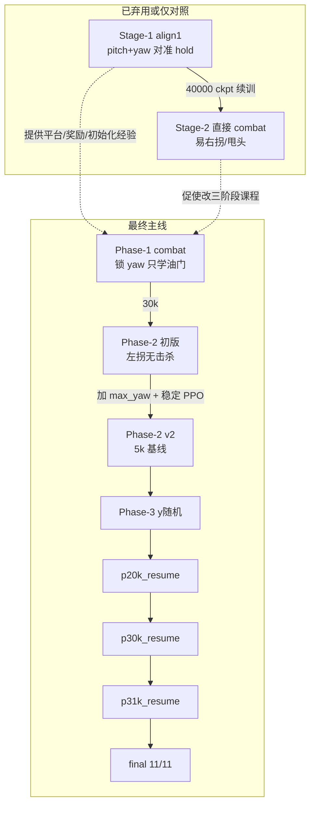
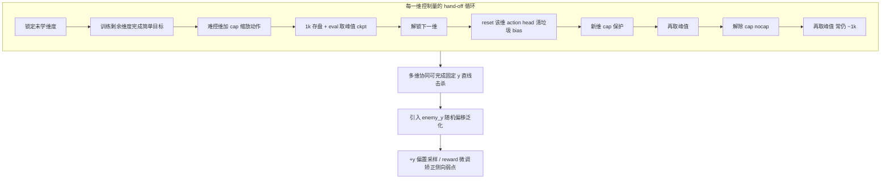

# 课程大作业第一题总结（完整版）

> **题目**：在 `simple_dynamics` 下控制油门、俯仰、滚转、偏航，击落 ≥1000 m 处固定靶机。  
> **算法**：PPO（Stable-Baselines3）  
> **动力学**：simple_dynamics（combat 阶段）  
> **定稿模型（旧线 p31k）**：`model/stage2_phase3_p31k_resume/ppo_combat_p3_p31k_resume_final.zip`（y 扫点 **11/11**，锁 pitch）  
> **定稿模型（v3 四维线）**：`model/stage2_phase3_v3_pitch_nocap_p5k_resume/ppo_combat_p3_v3_pitch_nocap_p5k_resume_7000_steps.zip`（y 扫点 **11/11**；备选 **8k** 同 K、yaw 更正）  
> **代码目录**：`Reinforcement-learning-drone/`  
> **最后更新**：2026-07-01  
> **合并自**：`STAGE1_会话总结.md`、`STAGE2_会话总结.md`、`STAGE2_P3_会话总结.md`、`TRAINING_总结.md`

---

## 目录

1. [题目要求对照](#1-题目要求对照)  
2. [思路演变总览（报告核心）](#2-思路演变总览报告核心)  
3. [阶段一：Stage-1 对准（align1）](#3-阶段一stage-1-对准align1)  
4. [阶段二：Stage-1 → Stage-2 直接续训（已弃用）](#4-阶段二stage-1--stage-2-直接续训已弃用)  
5. [阶段三：Combat 三阶段课程（最终主线）](#5-阶段三combat-三阶段课程最终主线)  
6. [阶段四：P2 v2 改造与 P3 泛化](#6-阶段四p2-v2-改造与-p3-泛化)  
7. [阶段五：短续训与「峰值早停」范式](#7-阶段五短续训与峰值早停范式)  
8. [阶段六：v3 实验线（reset yaw + pitch 解锁）](#8-阶段六v3-实验线reset-yaw--pitch-解锁)  
9. [定稿设计与实现细节](#9-定稿设计与实现细节)  
10. [Eval 结果演进](#10-eval-结果演进)  
11. [Checkpoint 索引](#11-checkpoint-索引)  
12. [踩坑清单](#12-踩坑清单)  
13. [实验心得与报告可写要点](#13-实验心得与报告可写要点)（含 **§13.5 分段解锁学习策略**）  
14. [常用命令](#14-常用命令)  
15. [相关文档](#15-相关文档)  
16. [一句话](#16-一句话)

---

## 1. 题目要求对照

| 要求 | 本方案 |
|------|--------|
| 初始间距 ≥ 1000 m | `(0,0,100)` → `(120,y,100)` = **1200 m**（1 unit = 10 m） |
| 不能仅用油门 | **油门 + yaw**；roll / pitch 锁定 |
| 控制量可取舍 | 分阶段解锁（P1 只油门 → P2 加 yaw → P3 加 y 随机） |
| 分段训练 | 见 §2 思路演变 |
| simple_dynamics | combat 全程 |
| 展示用训练完智能体 | 旧线：`p31k_resume_final`；**v3 四维**：`p5k_resume@7k`（§8.8） |

---

## 2. 思路演变总览（报告核心）

本题的求解不是「一次训到底」，而是 **五条路线迭代、三次范式转变**。下图概括最终采用的路线；虚线表示尝试过但放弃或仅作对照。



### 2.1 三次范式转变

| 次序 | 从 | 到 | 触发原因 |
|------|----|----|----------|
| **① 任务分解** | 四维同训 / 先对准再 combat | **Combat 内分 P1/P2/P3 解锁动作** | Stage-1 续 combat 转向习惯错误；四维样本效率低 |
| **② 奖励与信号** | damage 须在攻击盒内 | **HP 下降即给分** + 速度/overshoot  shaping | TensorBoard `enemy_damage_mean=0` 但 UE 已扣血 |
| **③ 训练节奏** | 长训 40k~80k 步 | **短续训 + 1k 存盘 + y 扫点 eval + 峰值早停** | 续训前 1k~3k 最好，之后左偏坍缩至 -10°~-15° |

### 2.2 思路变化时间线（便于写报告「设计过程」）

| 时期 | 想法 | 结果 | 下一步决策 |
|------|------|------|------------|
| **Stage-1 早期** | 30° 圆锥 + setup 摆姿态 | 平台不吃错误角度编码 | 放弃 setup，搞清 int32 yaw |
| **Stage-1 中期** | yaw=3 背对靶 | 不符合「正对接敌」展示 | 改 yaw=0 + 敌 y 偏移 |
| **Stage-1 后期** | pitch/yaw 对准 + hold 课程至 68 步 | 40000 ckpt 最好，后期 hold 过难崩溃 | 保留作子任务经验，**不直接续 combat** |
| **Stage-2 旧路线** | align1@40k → combat 续训，放开油门 | 易「往右拐」、甩头 | **放弃续训，combat 从零 P1** |
| **P1** | 锁 yaw，只学油门 + 控速 | 30k **3/3 击杀**，油门 ~0.12 | 进入 P2 解锁 yaw |
| **P2 初版** | 解锁 yaw，lr=1e-4，无 max_yaw | **0 击杀**，持续左拐，attack_box 恒负 | 分析为 P1 遗留 action[3] 负偏置 |
| **P2 v2** | +max_yaw 0.15、yaw 惩罚、lr 5e-5、n_epochs 3 | **5k ckpt 最稳**，后续步数退化 | 以 5k 进 P3 |
| **P3 首轮** | y∈[-5,5] 均匀随机 | 20k **+1 击杀**；25k~30k 左偏加重 | y 扫点 eval 发现 -y 易 +y 难 |
| **p20k_resume** | 首次 +y 偏置 0.78 | 30k +2 几乎击杀 | 确认「初期好、后期崩」 |
| **p30k_resume** | 1k 存盘，从 30k 短续 | **31k = 8/11（+2 击杀）** | 35k 起 K=3 崩溃 |
| **p31k_resume** | lr 1e-5、n_epochs 1、clip 0.04 | **final = 11/11 击杀** | **定稿，准备录像与报告** |
| **v3 线（2026-07）** | reset yaw/pitch + 分段 cap/nocap | P3@5k **10/11** | 四维实验线 |
| **v3 p5k 短续** | +y 0.75、`pitch_up_weight` | **@7k = 11/11** | **v3 四维定稿** |

### 2.3 设计思想一句话演进

> **「先对准」→「先接敌再转向」→「先扣血再泛化侧向」→「短步微调、峰值即停」**

---

## 3. 阶段一：Stage-1 对准（align1）

> 详细交接：`STAGE1_会话总结.md`

### 3.1 当时的目标

- **任务**：机头对准靶机视线（LOS），连续保持 hold 若干步即成功。  
- **不做**：追击、开火、油门（恒 0）。  
- **动作**：锁 throttle/roll，学 **pitch + yaw**，`action_scale=0.35`。

### 3.2 初始化思路的演变

| 版本 | 方案 | 结论 |
|------|------|------|
| 初版 | 30° 圆锥 + `setup_orientation` | 角度编码错误 / 跑满 200 步 |
| 中间 | 根目录 `yaw=3` 背对 | 用户要求不要背对 |
| 中间 | `yaw=±1` 随机 | 与 y 组合复杂 |
| **定稿** | **`yaw=0`（int32）+ 敌 `y∈[-8,8]`** | 角差 0°~3.8°，无需 setup |

```
我方: (0, 0, 100)   高度 1000 m，速度 0
敌方: (120, y, 100) 前方 1200 m
yaw:  0（机头 +x）
```

### 3.3 奖励与成功条件（思路：单调对准 + 课程 hold）

- **对准阈值**：从 15° 逐步收紧到 **1°**（必须比初始最大角差 ~3.8° 更严）。  
- **hold 课程**：起始 8 步，每成功 3 局 +4 步，上限 40。  
- **奖励核心**：`cosine` 单调、`tight` 进阈值才有、`hold` 随保持步数增加、`success_bonus = 10×required_hold`。

### 3.4 训练结论（为何不再直接续 combat）

- **最佳 ckpt**：`ppo_align1_v3_40000_steps.zip`（512 步 eval mean max_hold≈42.7）。  
- **50k~70k**：hold 涨到 ~68 步后成功率崩溃；80000/final 仅部分恢复。  
- **现象**：能对准但 **std≈0.37 随机策略易「甩头」**。  
- **对第一题的最终影响**：Stage-1 提供了 **平台约定、obs/reward 工程经验、y 偏移初始化**，但 **Stage-1→combat 续训因转向习惯不匹配而放弃**（见 §4）。

---

## 4. 阶段二：Stage-1 → Stage-2 直接续训（已弃用）

> 详细记录：`TRAINING_总结.md` §4、§8

### 4.1 当时的想法

- 几何与 Stage-1 一致，初速 **10 unit = 100 m/s**，从 align1@40k **续训 combat**。  
- 锁 pitch（同高度），放开油门，y 先固定为 0。

### 4.2 遇到的问题

| 现象 | 分析 |
|------|------|
| 总往 **右** 拐 | Stage-1 练 pitch/yaw 对准；combat 带 100 m/s + 侧向靶需不同转向逻辑 |
| 扣血但 `damage_mean=0` | 旧 reward 要求攻击盒内才给 damage（已在 combat 新代码中修复） |
| eval 初始角差 30°~90° | 局间未 `finish_round`，UE 状态脏 |
| 100 m/s 难击杀 | 飞越攻击区步数少，每 hit 仅 -0.01 HP |

### 4.3 决策：改为 Combat 内三阶段课程

**动机**（`TRAINING_总结.md` §10.1）：在 combat 任务本身里分步解锁，避免 Stage-1 的 pitch/yaw 习惯污染接敌策略。

| 阶段 | 锁定 | 自由 | 目标 |
|------|------|------|------|
| P1 | roll/pitch/**yaw** | 油门 | 正对靶直线接敌、扣血节奏 |
| P2 | roll/pitch | 油门+yaw | 在 P1 上学会转向 |
| P3 | roll/pitch | 油门+yaw | y 随机泛化 |

---

## 5. 阶段三：Combat 三阶段课程（最终主线）

> 详细交接：`STAGE2_会话总结.md`

### 5.1 Phase-1：只学油门（✅ 过关）

**配置**：`envs.stage2.phase1.yaml`，y=0，`lock_yaw=true`，`max_throttle=0.35`。

**奖励思路变化（相对 Stage-2 旧版）**：

| 改动 | 目的 |
|------|------|
| `enemy_damage` 只看 HP 差 | 与 UE 扣血一致 |
| 削弱 `distance_progress`（/150，cap ±0.5） | 防盲目全油门冲刺 |
| `speed_penalty` / `attack_speed_penalty` | simple_dynamics **无刹车**，靠收油控速 |
| `overshoot_margin_m: 30` | 飞过靶前截停，不学绕回 |

**结果**（eval 3 局）：

| 指标 | 值 |
|------|-----|
| 击杀 | **3/3** |
| 步数 | ~175 |
| 油门 | **0.11~0.12**（收油接敌） |
| ckpt | **`ppo_combat_p1_30000_steps.zip`** |

**隐性代价**：锁 yaw 时 **action[3] 无环境梯度**，权重漂移到 **-0.11 ~ -0.20**——成为 P2 左拐根因（当时未意识到，见 §6）。

### 5.2 Phase-2 初版：解锁 yaw（❌ 失败）

**配置**：`envs.stage2.phase2.yaml`，从 P1@30k 续训，`lr=1e-4`，**无 max_yaw**。

**现象**：

- 目视 **持续左拐**；rollout **0 击杀**；`ep_rew_mean` 2652 → ~480。  
- `alignment_mean` 仍高，但 **`attack_box_mean` 恒负**（横向偏出 ±10 m）。  
- 离线测：**action[3] ≈ -0.085**（det），与 P1 遗留偏置一致。

**当时的思路误区**：以为纯 reward / 探索不够；后证实 **主因是锁维度遗留偏置 + PPO 更新仍偏激进**。

---

## 6. 阶段四：P2 v2 改造与 P3 泛化

> 详细交接：`STAGE2_P3_会话总结.md`

### 6.1 P2 v2：动作与 PPO 的思路调整

**动作层**：

```yaml
max_yaw: 0.15          # 新增：类比 max_throttle，限制舵量
yaw_misalign_weight: 10.0   # 新增：-weight×(1-cos)
action_scale: 0.4
```

**PPO 层**（相对 P2 初版）：

| 参数 | P2 初版 | P2 v2 | 原因 |
|------|---------|-------|------|
| learning_rate | 1e-4 | **5e-5** | iter8 damage 高后 iter9 崩溃 |
| n_epochs | 5 | **3** | 减小过更新 |
| n_steps | 512/2048 | **768** | 折中采样量 |
| clip_range | 0.2 | **0.1** | 更稳 |

**结果**：**5000 steps** 在 y=0 上相对最稳，选作 P3 基线；后续步数并未持续变好。

### 6.2 Phase-3：y 随机与 +y 难题

**配置**：`enemy_y_range: [-5, 5]`，从 p2_v2@5000 续训。

**y 扫点 eval（p2_v2@5000 基线）**——第一次系统化看泛化：

| 区域 | 击杀 | final_yaw |
|------|------|-----------|
| y ≤ 0 | **6/6** | ~-6.4°~-7.4° |
| y > 0 | **0/5** | 仍 ~-6°（**不随 y 变向**） |

**思路转变**：

1. 左偏对 **-y 歪打正着**，对 **+y 致命**——不是 reward 不对称，是 **策略 yaw 与敌侧向无关**。  
2. 计划用 `enemy_y_positive_prob` 过采样 +y（**P3 首轮实际训练多为均匀 y**，偏置在后续 resume 才启用）。  
3. P3@20k 首次 **+1 击杀**；25k~30k 又左偏加重至 -15°。

**曾尝试又回退的 reward  tweak**：减半 alignment、damage 12、yaw 惩罚降到 6——效果不如稳定 PPO + 短续训。

---

## 7. 阶段五：短续训与「峰值早停」范式

这是定稿前 **最后一次思路转变**：接受「**不能长训，只能在峰值附近微调**」。

### 7.1 观察到的规律

| 续训轮次 | 起点 | 最好步数 | 之后现象 |
|----------|------|----------|----------|
| p20k_resume | P3@20k | ~30k | 35k yaw -10°，K=3 |
| p30k_resume | p20k@30k | **31k（8/11，+2 杀）** | 33k K=5，35k K=3 |
| p31k_resume | p30k@31k | **final（11/11）** | 32k 仍 7/11，34k 9/11 |

**共性**：续训 **前 1000~3000 步** 往往改善或维持；继续更新则 **左偏幅度增大**（-5° → -10° → -15°），击杀从 y≤0 蔓延到全线崩溃。

### 7.2 应对策略（最终采用）

| 手段 | 具体做法 |
|------|----------|
| **峰值 ckpt 短续** | 从 20k/30k/31k 等 eval 最好点重启，每次只训 5k~10k |
| **1k 存盘** | `save_freq: 1000`，便于在坍缩前截获 |
| **y 扫点 eval** | 11 个 y 各 1 局，指标：击杀数 K、+5 hp、final_yaw |
| **PPO 逐级保守** | lr 3e-5→2e-5→**1e-5**；n_epochs 3→2→**1**；clip 0.08→0.06→**0.04** |
| **+y 偏置** | 0.78→0.75→0.70，略降以防过拟合难样本 |
| **reset yaw head** | v3 线 P1→P2 采用（见 §8）；旧线未用 |

### 7.3 p31k_resume 定稿超参

```yaml
learning_rate: 1.0e-5
n_epochs: 1
clip_range: 0.04
target_kl: 0.015
ent_coef: 0.008
save_freq: 1000
load_path: p30k_resume_31000_steps.zip
```

---

## 8. 阶段六：v3 实验线（reset yaw + pitch 解锁）

> **动机**：旧线 P2 未 reset yaw；定稿虽 11/11 但 **锁 pitch**。2026-07 在 **Q1 分支** 重跑 P2→P3，引入 `reset_yaw_head` / `reset_pitch_head`、nocap 与 pitch 解锁，**独立目录**，不覆盖旧 `stage2_phase2_v2` / `p31k_resume` 模型。

### 8.1 课程链（v3 nocap + pitch 线）

```mermaid
flowchart LR
    P1[P1@30k 锁yaw] -->|reset yaw| P2v3[P2 v3 cap 9k]
    P2v3 -->|1k 峰值| Nocap[yaw nocap 5k]
    Nocap -->|1k 峰值| Pitch[pitch cap 5k]
    Pitch -->|1k 峰值| PNocap[pitch nocap 5k]
    PNocap --> P3[P3 y±5 30k]
    P3 -->|@5k 短续| P3r[p5k_resume @7k 11/11]
```

| 阶段 | 配置前缀 | 起点 | hand-off | 有效维度 |
|------|----------|------|----------|----------|
| P2 v3 | `stage2.phase2.v3` | P1@30k | **reset yaw** | 油门+yaw（max_yaw=0.15） |
| P2 v3 nocap | `stage2.phase2.v3.nocap` | p2_v3@1k | 无 reset | 油门+yaw（无 max_yaw） |
| P2 v3 pitch | `stage2.phase2.v3.pitch` | nocap@1k | **reset pitch** | 油门+pitch+yaw（max_pitch=0.15） |
| P2 v3 pitch nocap | `stage2.phase2.v3.pitch.nocap` | pitch@1k | 无 reset | 油门+pitch+yaw（无 cap） |
| P3 v3 pitch nocap | `stage2.phase3.v3_pitch_nocap` | pitch_nocap@1k | 无 reset | 同上，**y∈[-5,5]** |
| **P3 p5k 短续** | `stage2.phase3.v3_pitch_nocap.p5k_resume` | P3@5k | 无 reset | + **`pitch_up_weight`**、**+y 偏置 0.75** |

**实现**：`utils/policy_reset.py`（`reset_policy_yaw_head` / `reset_policy_pitch_head`）；`utils/action.py` 支持 `max_pitch`；`main.py` 支持 `reset_*_head_on_load`；`eval_policy.py` 输出 **`final_pitch_deg`** + `final_yaw_deg`。

### 8.2 P2 v3（reset yaw）— y=0 eval

从 P1@30k + reset yaw，room 20465/1005 训练至 9k 截停：

| ckpt | kills (y=0×3) | final_yaw |
|------|---------------|-----------|
| **1k** | 3/3 | **-0.16°** |
| 3k | 3/3 | -0.51° |
| 7k | 3/3 | +3.14°（右偏峰值） |

**结论**：reset yaw 有效；**1k~3k 最稳**，与旧 P2 v2「5k 峰值」不同（起点更干净）。

### 8.3 yaw nocap — y=0 eval

从 p2_v3@1k，5k 步：

| ckpt | kills | final_yaw |
|------|-------|-----------|
| **1k** | 3/3 | **-0.18°** |
| 5k/final | 0/3 | overshoot，hp≈0.05~0.19 |

### 8.4 pitch 解锁（max_pitch=0.15）— y=0 eval

从 nocap@1k + reset pitch：

| ckpt | kills | final_pitch | final_yaw |
|------|-------|-------------|-----------|
| **1k** | 3/3 | **+0.66°** | -1.29° |
| 4k | 3/3 | +5.30° | -0.50° |
| 5k/final | 0/3 | +10°~+12° | overshoot |

**结论**：pitch 阶段 **1k 峰值**（y=0）；解锁 pitch 后需 **reset pitch head**；训久 pitch 抬高 → 速度过大 → 飞过靶。

### 8.5 pitch nocap — y=0 eval

| ckpt | kills | final_pitch |
|------|-------|-------------|
| **1k** | 3/3 | +1.66° |
| 5k/final | 0/3 | +10°~+12° |

### 8.6 P3 y∈[-5,5] — y 扫点 eval（room 20563/1004）

训练：`envs.stage2.phase3.v3_pitch_nocap.yaml`，从 pitch_nocap@1k，**30k 步已完成**（`ppo_combat_p3_v3_pitch_nocap_final.zip`），`enemy_y_positive_prob: 0.70`。

| ckpt | **K** | +4 | +5 | 典型 pitch | 典型 yaw |
|------|-------|----|----|------------|----------|
| 1k | 9/11 | ❌ | ❌ | ~+2.5° | ~-4.7° |
| **2k** | **10/11** | ✅ | ❌ | ~+3.2° | ~-3.3° |
| **5k** | **10/11** | ✅ | ❌ | ~**+2.7°** | ~-3.4° |
| **6k** | **10/11** | ✅ | ❌ | ~+3.8° | ~-3.3° |
| 7k | 9/11 | ❌ | ❌ | ~+6.8° | ~-4.3° |
| 8k~9k | 8/11 | 部分 ❌ | ❌ | +7°~+10° | ~-3°~-4.5° |
| 10k+ | 0~2/11 | ❌ | ❌ | +12°+ | overshoot 坍缩 |

**CSV**：`logs/stage2_phase3_v3_pitch_nocap/eval/phase3_v3_pitch_nocap_by_y_summary.csv`（截至 9k；10k~30k 未完整 eval，终端试跑 10k/11k 已坍缩）

**关键修正（相对 §7「越早越好」）**：

- **P2 / 单点 y=0**：仍倾向 **1k 早停**（姿态最正）。  
- **P3 / y 扫点**：需 **2k~6k** 适应侧向靶；**1k 仅 9/11**（+4/+5 弱）。  
- **选 ckpt 主指标**：P3 以 **K 优先**，pitch/yaw 为辅；5k 在 K 与 pitch 间较均衡。  
- **+5 在 P3@5k 未稳杀** → 已由 **§8.8 p5k 短续 @7k** 解决（11/11）。

### 8.7 姿态漂移与 optimizer（报告可写）

- 训久常见 **pitch 上偏、yaw 左偏**；超过阈值后 overshoot 增多，中间 ckpt 可能 **非单调回弹**。  
- **reset head 未 reset optimizer**：理论上 hand-off 时 Adam 动量可能加重偏置；pitch unlock 更相关；**非规范问题**，可作 ablation。  
- 击杀 reward 饱和后，冗余维 **欠定**，TensorBoard 易误导，**必须以 y 扫点 + pitch/yaw 为准**。

### 8.8 P3 @5k 短续训定稿（+y 偏置 + pitch 抬头惩罚）

从 P3@5k（K=10/11，+5 未杀）短续 5k 步：`enemy_y_positive_prob: 0.75`，`pitch_up_weight: 6.0`，保守 PPO（room **20572/1000** 训，**1006** eval）。

| ckpt | **K** | +5 hp | 典型 pitch | 典型 yaw | 备注 |
|------|-------|-------|------------|----------|------|
| 6k | 10/11 | 0.47 | ~+4.3° | ~-3.4° | +5 仍 overshoot |
| **7k** | **11/11** | **0.00** | ~**+4.0°** | ~-2.1° | **v3 定稿（推荐）** |
| **8k** | **11/11** | **0.00** | ~+4.7° | ~**-1.9°** | 同 K，yaw 更正、pitch 略高 |
| 9k | 7/11 | 0.82 | ~+6.0° | ~-7.3° | +y 侧坍缩 |
| 10k/final | 4~5/11 | — | ~+3° | ~-10° | 左偏加重，勿用 |

**相对 P3@5k 的改进**：+5 由 ❌→✅；`enemy_y_positive_prob` 0.70→0.75 + 短续训有效。**7k vs 8k**：K 相同，7k pitch 更低，8k yaw 左偏更小；录像/报告默认 **7k**。

**CSV**：`logs/stage2_phase3_v3_pitch_nocap_p5k_resume/eval/phase3_v3_pitch_nocap_p5k_resume_by_y_summary.csv`

---

## 9. 定稿设计与实现细节

> 以下为 **旧线 p31k（锁 pitch）** 定稿；v3 实验线动作见 §8.1。

### 9.1 Agent 与网络

| 项 | 定稿 |
|----|------|
| 算法 | PPO，`MlpPolicy` |
| 网络 | Actor/Critic **128-128**，Tanh |
| 观测 | **20 维**，`[-1,1]`（`utils/observation.py`） |
| 动作 | **4 维**网络输出 → `marshal_action` 映射 |

### 9.2 动作（旧线定稿）

| 维 | 控制 | 定稿 |
|----|------|------|
| [0] throttle | [0, 0.35] | 学习 |
| [1] pitch | 0 | **锁定** |
| [2] roll | 0 | **锁定** |
| [3] yaw | ±0.15（×0.4 scale） | 学习 |

### 9.3 观测（20 维摘要）

相对位置、距离、双机视线 cos、速度/高度/HP 差、接近速度、我机姿态、攻击几何（前向距、横向误差、射程带）。  
敌 `(0,0,0)` 时用 `set_enemy_fallback_position([120,0,100])`。

### 9.4 奖励（定稿 combat）

**Shaping**：distance_progress（削弱）、alignment、yaw_misalign_penalty(10)、attack_box/corridor/centerline、speed/attack_speed 惩罚、overshoot(-8)、survival(-0.02/步)。

**稀疏**：`enemy_damage`（**HP 降即 +12/ hit**）、enemy_hp_shaping、kill_bonus/death_penalty(±300)。

**设计原则演变**：从「必须在攻击盒内才给 damage」→「**平台扣血即反馈**」；shaping 引导接敌，但不阻断 damage 信号。

### 9.5 终止与截断

- terminated：击杀 / 阵亡  
- truncated：512 步、overshoot（fwd < 30 m）、坠地/过远  
- **每局 `_send_finish_round()`**（truncation=1）

### 9.6 初始化（combat 定稿）

- 我机 `(0,0,100)`，初速 `[10,0,0]` → 100 m/s  
- 敌机 `(120,y,100)`，P3：`y∈[-5,5]`，可选 `enemy_y_positive_prob` 分侧采样

---

## 10. Eval 结果演进

### 10.1 y 扫点协议

- **旧线定稿**：`scripts/eval_stage2_phase3_by_y.py`  
- **v3 pitch 线**：`scripts/eval_stage2_phase3_v3_pitch_nocap_by_y.py`  
- **y ∈ {-5,…,+5} 各 1 局 deterministic**  
- 主指标：**击杀数 K**、各 y `enemy_hp`、**`final_pitch_deg`**、`final_yaw_deg`

### 10.2 关键节点对比（旧线 p31k）

| 模型 | K | +2 hp | +5 hp | yaw(+1) | 备注 |
|------|---|-------|-------|---------|------|
| p2_v2@5000 | 6/11 | 0.33 | 0.86 | -7.4° | -y 全杀，+y 全挂 |
| P3@20k | 7/11 | 0.28 | 0.84 | -6.3° | 首次 +1 杀 |
| p20k@30k | 7/11 | **0.02** | 0.75 | -5.5° | +2 几乎杀 |
| p30k@**31k** | **8/11** | **0.00** | 0.75 | -5.5° | **+2 杀** |
| p30k@35k | 3/11 | 0.68 | 1.00 | -11.9° | 坍缩 |
| **p31k final** | **11/11** | **0.00** | **0.00** | **-3.1°** | **定稿** |

### 10.3 定稿 final 明细（旧线）

| y | -5 | -4 | -3 | -2 | -1 | 0 | +1 | +2 | +3 | +4 | +5 |
|---|----|----|----|----|----|---|----|----|----|----|-----|
| enemy_hp | 0 | 0 | 0 | 0 | 0 | 0 | 0 | 0 | 0 | 0 | 0 |
| final_yaw_deg | -2.7 | -2.9 | -3.1 | -3.2 | -3.3 | -3.2 | -3.1 | -2.9 | -2.8 | -2.6 | -2.4 |

CSV：`logs/stage2_phase3_p31k_resume/eval/p31k_resume_all_by_y.csv`

### 10.4 v3 线 Eval 摘要

| 阶段 | 最佳 ckpt | K | 备注 |
|------|-----------|---|------|
| P3 首轮 | @5k/6k | 10/11 | +5 弱，见 §8.6 |
| **p5k 短续** | **@7k** | **11/11** | **v3 四维定稿**，见 §8.8 |

旧线 p31k：**11/11**（§10.3）。

---

## 11. Checkpoint 索引

### 11.1 旧线（定稿 11/11）

| 路径 | 阶段 | 说明 |
|------|------|------|
| `model/stage1_align_v3/ppo_align1_v3_40000_steps.zip` | Stage-1 | 对准子任务（未用于 combat 续训） |
| `model/stage2_phase1/ppo_combat_p1_30000_steps.zip` | P1 | 油门接敌 |
| `model/stage2_phase2_v2/ppo_combat_p2_v2_5000_steps.zip` | P2 v2 | P3 起点 / +y 问题基线 |
| `model/stage2_phase3/ppo_combat_p3_20000_steps.zip` | P3 | 首次 +1 击杀 |
| `model/stage2_phase3_p30k_resume/ppo_combat_p3_p30k_resume_31000_steps.zip` | 短续 | 8/11 峰值 |
| **`model/stage2_phase3_p31k_resume/ppo_combat_p3_p31k_resume_final.zip`** | **定稿** | **11/11** |

### 11.2 v3 实验线（2026-07，独立目录）

| 路径 | 阶段 | 说明 |
|------|------|------|
| `model/stage2_phase1/ppo_combat_p1_30000_steps.zip` | P1 | 共用起点 |
| `model/stage2_phase2_v3/ppo_combat_p2_v3_1000_steps.zip` | P2 v3 | reset yaw，y=0 3/3 |
| `model/stage2_phase2_v3_nocap/ppo_combat_p2_v3_nocap_1000_steps.zip` | yaw nocap | y=0 峰值 |
| `model/stage2_phase2_v3_pitch/ppo_combat_p2_v3_pitch_1000_steps.zip` | pitch cap | reset pitch，y=0 峰值 |
| `model/stage2_phase2_v3_pitch_nocap/ppo_combat_p2_v3_pitch_nocap_1000_steps.zip` | pitch nocap | P3 训练起点 |
| `model/stage2_phase3_v3_pitch_nocap/ppo_combat_p3_v3_pitch_nocap_5000_steps.zip` | P3 | K=10/11，短续起点 |
| `model/stage2_phase3_v3_pitch_nocap/ppo_combat_p3_v3_pitch_nocap_final.zip` | P3 终盘 | **勿用**（10k+ 坍缩） |
| **`model/stage2_phase3_v3_pitch_nocap_p5k_resume/ppo_combat_p3_v3_pitch_nocap_p5k_resume_7000_steps.zip`** | **v3 定稿** | **11/11**，pitch+yaw 全开 |
| `model/stage2_phase3_v3_pitch_nocap_p5k_resume/ppo_combat_p3_v3_pitch_nocap_p5k_resume_8000_steps.zip` | v3 备选 | 11/11，yaw -1.9° |

**配置索引**：`config/envs.stage2.phase2.v3*.yaml`、`config/algs.stage2.phase2.v3*.yaml`、`config/envs.stage2.phase3.v3_pitch_nocap*.yaml`

---

## 12. 踩坑清单

| 现象 | 原因 | 处理 |
|------|------|------|
| 初始角 yaw 无效 | degrees/mrad 编码 | **int32 yaw**，y=0 + 敌 y 偏移 |
| setup 跑满 200 步 | 启发式与平台不同步 | **默认关 setup** |
| damage_mean=0 但 UE 扣血 | reward 要求攻击盒内 | **HP 差直反馈** |
| eval 初始角 30°~90° | 未 finish_round | `_send_finish_round()` |
| Stage-1→combat 右拐 | 对准习惯 vs 带速 combat | **改 P1/P2/P3 课程** |
| P2 左拐无击杀 | P1 lock yaw → action[3] 负偏置 | max_yaw + yaw 惩罚 + 短续训 |
| +y 不杀、-y 全杀 | 恒定左偏，非 reward 不对称 | y 扫点诊断；+y 过采样；峰值早停 |
| 续训越训越差 | PPO 过更新 | lr↓ epochs↓ clip↓ target_kl↓ 1k 存盘 |
| 第二局断连 | UE 比赛轮数不足 | 轮数 ≥ 总步数/512 |
| P3 用 1k 但 K 低 | P2 早停 ≠ P3 泛化峰值 | P3 看 **y 扫点 K**，常需 2k~6k |
| eval 不看 pitch | 脚本仅 yaw | 已加 `final_pitch_deg` |
| pitch 解锁后 overshoot | pitch↑ → 速度↑ | cap + 1k 早停；P3 以 K 选 ckpt |
| reset head 未 reset optimizer | Adam 动量残留 | 可选 ablation；pitch hand-off 更敏感 |
| p5k 短续 9k+ 再崩 | 同 §7 过更新 | 7k~8k 即停；勿用 final |

---

## 13. 实验心得与报告可写要点

### 13.1 方法层面

1. **任务分解优于一次端到端**：第一题虽要求四维可控，但 **课程式解锁** 符合题目「分段训练」精神，且样本效率高。  
2. **子任务续训要谨慎**：Stage-1 对准与 combat 接敌的 **动作语义不同**，直接续训引入错误先验。  
3. **锁维度 = 未训维度的随机游走**：P1 锁 yaw 是正确课程步骤，但 P2 解锁时必须 **`reset_yaw_head_on_load`**（v3 线已用）；pitch 同理 **`reset_pitch_head_on_load`**。  
4. **奖励要与平台反馈对齐**：HP 直反馈是训练能「看见」扣血的关键转折。  
5. **在线 PPO 的「软坍缩」**：loss 不大但策略漂移；**eval 比 TensorBoard 更可信**。  
6. **早停指标因阶段而异**：y=0 看姿态正；**P3 y 扫点以 K 为主**，勿机械套用 P2 的 1k 规则。

### 13.2 工程层面

- 训练 / eval **分房间**；  
- **y 扫点 eval** + **pitch/yaw** 双姿态指标；  
- **密集 ckpt + 峰值早停** 优于盲目拉长 total_timesteps。

### 13.3 报告建议结构

1. 题目与平台约定  
2. **思路演变**（§2，配时间线表）  
3. Agent / obs / reward / done 定稿设计（§9）  
4. 训练现象与数据分析（左偏、attack_box、K 随步数变化）  
5. Eval 演进表（§10）与 v3 线 §8.8  
6. **分段解锁学习策略**（§13.5，方法论核心）  
7. 心得与第二题展望（junior_dynamics）

### 13.4 后续

- **旧线定稿**：p31k **11/11**（锁 pitch，提交备选）。  
- **v3 四维定稿**：p5k_resume **@7k 11/11**（pitch+yaw 全开，y∈[-5,5]）；备选 **8k**。  
- **第二题**：见 `第二题总结.md`（junior_dynamics，Q2 分支）。

### 13.5 分段解锁学习策略（报告方法论核心）

本节归纳 v3 线与旧线共同验证的 **「锁→训→cap→峰值→解锁→清 bias→…→随机偏移」** 范式，并回答：为何锁维度会留下倾向、倾向如何与泛化相互作用、为何 1k 常最优而 random-y 不适用、以及偏移放大 / 随机 z 的推论。

#### 13.5.1 策略链条（本项目的完整实例）



| 步骤 | v3 线对应 | 简单目标 |
|------|-----------|----------|
| 锁大部分 | P1 锁 yaw/pitch/roll | y=0 油门接敌 |
| 训剩余 | P1 学 throttle | 3/3 击杀 |
| cap | P2 `max_yaw=0.15` | 限制舵量防甩头 |
| 峰值 | P2 v3 **@1k**（y=0） | reset yaw 后最稳 |
| 解锁 + 清 bias | nocap → pitch：**reset pitch** | 避免锁维权重漂移 |
| nocap 峰值 | 各子阶段 **@1k**（y=0） | pitch/yaw 训久必漂 |
| 随机 y | P3 y∈[-5,5] | 侧向泛化 |
| 侧向矫正 | p5k_resume：`enemy_y_positive_prob: 0.75` + `pitch_up_weight` | +5 由失败→成功 |

**设计目的**：用 **低维、固定几何** 的子问题先把「接敌—扣血—击杀」链路训通，再逐步增加动作自由度与场景随机性，最终用 **诸多控制量协同** 完成原题（≥1000 m 击落靶机），而非一次端到端四维同训。

#### 13.5.2 锁维度未清理干净 → 天然倾向性

锁某一动作维时，环境 **不反馈该维梯度**，但 PPO 仍更新共享 trunk 与 **该维 head 权重**（探索噪声、weight decay、与其他维耦合），等价于 **高维空间中的随机游走 + 隐性偏置**：

- **旧线**：P1 锁 yaw → `action[3]≈-0.11~-0.20` → P2 解锁后 **立刻左拐**（未 reset head）。  
- **v3 线**：P1 锁 yaw 后 **reset yaw head** → P2@1k yaw **-0.16°**；未 reset 则重现旧线问题。  
- **pitch**：P2 锁 pitch 期间 pitch head 漂移 → unlock 后即使 reset，**optimizer 动量** 仍可能带来 **解锁即左俯（抬头）**；v3 观测 pitch 由 ~+1.7°（@1k）漂至 +10°+（训久）。

**结论**：「锁」不是 neutral——必须在 unlock 时 **reset head（清 bias）+ cap（限幅）+ 短训峰值早停**；否则倾向性会在 unlock 瞬间或 nocap 后 **写入行为策略**。

#### 13.5.3 倾向性对 fixed-y 与 random-y 的不对称帮助

以 **yaw 左偏** 为例（本环境常见）：

| 敌 y | 几何需求 | 恒定左偏的效果 |
|------|----------|----------------|
| y ≤ 0（敌在左或正中） | 需略向右转或直行 | 左偏 → **歪打正着**，-y 易杀 |
| y > 0（敌在右） | 需向右转 | 左偏 → **与需求相反**，+y 难杀 |

因此在 **y=0 固定靶** 上，策略可以 **靠错误 yaw 偏置仍完成击杀**（simple 目标已满足），eval 看起来「能杀」；一旦 **random y**，偏置从「无害甚至有益」变为 **系统性弱点**。旧线 p2_v2@5k：**-y 6/6、+y 0/5** 即典型诊断。

**评价 `enemy_y_positive_prob` 偏置采样**：

- **机制**：训练时提高 +y 出现频率（如 0.75：75% 采 y∈[1,5]，25% 采 y∈[-5,-1]），迫使策略 **多见难侧**，相当于 **针对弱侧的 curriculum oversampling**。  
- **优点**：不改网络结构；与旧线 p20k/p31k、v3 p5k_resume 一致有效；**+5 从失败到 11/11** 有直接证据。  
- **局限**：(1) 仍依赖 **峰值 ckpt**，训久 PPO 会再次把 yaw 拉向左（9k→10k K 从 11→4）；(2) 不改变 **测试分布**（eval 仍均匀 y），属于 **train-test 分布刻意错配**；(3) 偏置过大可能 **欠拟合 -y**（本实验 0.75 未观察到）。  
- **与 reset/cap 的关系**：偏置采样是 **泛化阶段** 的矫正；**不能替代** unlock 时的 head reset，二者正交。

#### 13.5.4 为何子阶段常在 ~1k 步出现最优

在 **固定 y=0、单点几何** 下：

1. **任务快饱和**：击杀 reward 稀疏但巨大，数千步内策略已能稳定 3/3；继续更新主要在 **冗余维（pitch/yaw）上探索**，对 y=0 击杀无增量。  
2. **cap 保护有限时长**：max_yaw / max_pitch 把危险动作压住；**解除 cap 后** 同一策略会放大输出 → overshoot。  
3. **PPO 过更新**：lr×n_epochs 累积，shared trunk 漂移 → 姿态 **单调偏转**（pitch↑、yaw←），TensorBoard loss 仍平滑。  
4. **1k 存盘** 恰好落在 **「刚学会击杀、尚未漂移」** 窗口。

故 **「1k 最优」是 fixed-y、子目标、cap/nocap  hand-off 的联合现象**，不是 universal 规律。

#### 13.5.5 同一经验在 random-y 上为何不适配

P3 引入 y∈[-5,5] 后：

| 现象 | 原因 |
|------|------|
| P3@1k 仅 **9/11** | 侧向几何未充分采样；+4/+5 需 **额外 1k~4k** 适应 |
| P3 **5k~6k** K=10/11 而 P2 **1k** 已 3/3 | 泛化目标 **更高维（y×姿态）**，需更多步调整 yaw/pitch **随 y 变化** |
| 10k+ 再次坍缩 | 与 §7 相同：击杀饱和后继续更新 → 左偏加重 |
| p5k 短续 **7k** 才 11/11 | 在 **10/11 峰值** 上微调 + +y 偏置，需 **~2k 有效步**；仍遵循「短续、峰值即停」 |

**规则**：子阶段用 **y=0 + 姿态** 选 ckpt；P3 用 **y 扫点 K** 选 ckpt；**禁止**把 P2 的 1k 规则机械套到 P3。

#### 13.5.6 若引入随机 z（高度偏移）的推论

当前同高度 combat（z=100 unit）未训 **pitch 的高度语义**；若扩展 `enemy_z_range`：

| 可能倾向 | 机制 | 矫正思路 |
|----------|------|----------|
| pitch **持续上偏或下偏** | 锁 pitch 期 drift；或 throttle–pitch 耦合控速 | unlock 时 reset pitch；`pitch_up_weight` / 对称 `pitch_down_weight`；`max_pitch` cap |
| yaw/roll 与 z 耦合 | 斜线 LOS 需二维对准 | 分阶段：先 random y 再 random z；或 **reset + cap** 再解锁 roll |
| 某一 z 侧「歪打正着」 | 与 yaw–y 类似：固定偏置在部分 z 有益、另一侧有害 | **`enemy_z_positive_prob`** 或过采样难 z 侧；z 扫点 eval |
| 速度/overshoot 加剧 | pitch 改高度 → 弹道与 closure 变化 | 加强 `attack_speed_penalty`；短续训 |

**本质**：每增加一个随机偏移维，就增加 **「偏置在某半空间有用、另一半有害」** 的机会；hand-off 循环与 **侧向偏置采样 + 扫点 eval** 应 **每个新随机维重复一遍**。

#### 13.5.7 放大偏移量（y: ±5 → ±8、±10…）会如何

结合旧线 Stage-1（y∈[-8,8]）与 P3（y∈[-5,5]）经验：

1. **几何**：横向角差 ∝ arctan(y/120)；|y| 越大，所需 **|yaw| 越大**，对 **恒定左偏** 的容忍度越不对称（-y 更易、+y 更难）。  
2. **攻击盒**：横向误差 ∝ y；大 |y| 时 **corridor/attack_box** shaping 更敏感，略偏即出盒。  
3. **训练**：需 **更长 P3 或更多短续**，且 **+y 偏置可能需更高**（0.78~0.85）；否则 K 随 |y| 单调降。  
4. **定稿**：p31k / v3@7k 在 ±5 **已满**；放大 y **非题面必须**；若做应 **从峰值 ckpt 短续 + y 扫点扩 grid**，并预期 **峰值步数后移、更易坍缩**。

**报告可写一句**：偏移量放大 = **泛化难度超线性上升**；分段解锁与偏置采样提供的是 **可复用流程**，不是一次超参管到底。

---

## 14. 常用命令

```powershell
cd Reinforcement-learning-drone
..\venv\Scripts\Activate.ps1

# y 扫点 eval（定稿）
python scripts/eval_stage2_phase3_by_y.py `
  --checkpoint ./model/stage2_phase3_p31k_resume/ppo_combat_p3_p31k_resume_final.zip `
  --env-config ./config/envs.stage2.phase3.eval.yaml `
  --output ./logs/stage2_phase3_p31k_resume/eval/final_by_y.csv `
  --log-interval 0

# 可视化 eval（录像前试跑）
python scripts/eval_policy.py `
  --model ./model/stage2_phase3_p31k_resume/ppo_combat_p3_p31k_resume_final.zip `
  --env-config ./config/envs.stage2.phase3.eval.yaml `
  --episodes 3 --log-interval 20

# 单元测试
python -m unittest tests.test_reward_initialize_truncate tests.test_action_observation tests.test_policy_reset -v

# --- v3 实验线 ---

# P2 v3 批量 eval（y=0）
python scripts/eval_stage2_phase2_v3.py --episodes 3

# pitch / pitch nocap 批量 eval
python scripts/eval_stage2_phase2_v3_pitch.py --episodes 3
python scripts/eval_stage2_phase2_v3_pitch_nocap.py --episodes 3

# P3 v3 pitch nocap y 扫点
python scripts/eval_stage2_phase3_v3_pitch_nocap_by_y.py

# P3 p5k 短续 y 扫点（v3 定稿 eval，room 20572/1006）
python scripts/eval_stage2_phase3_v3_pitch_nocap_p5k_resume_by_y.py

# v3 定稿可视化
python scripts/eval_policy.py `
  --model ./model/stage2_phase3_v3_pitch_nocap_p5k_resume/ppo_combat_p3_v3_pitch_nocap_p5k_resume_7000_steps.zip `
  --env-config ./config/envs.stage2.phase3.v3_pitch_nocap.p5k_resume.eval.yaml `
  --episodes 3 --log-interval 20

# P3 v3 训练
python main.py `
  --env-config ./config/envs.stage2.phase3.v3_pitch_nocap.yaml `
  --config ./config/algs.stage2.phase3.v3_pitch_nocap.yaml
```

---

## 15. 相关文档

| 文件 | 内容 |
|------|------|
| `STAGE1_会话总结.md` | Stage-1 对准、初始化与 hold 课程 |
| `STAGE2_会话总结.md` | P1 成果、P2 左拐、reward 变更 |
| `STAGE2_P3_会话总结.md` | P2 v2、P3、y 扫点、+y 问题 |
| `TRAINING_总结.md` | 全局路线、踩坑、三阶段动机 |
| **本文** | **第一题完整总结（含 v3 实验线，报告主文档）** |

---

## 16. 一句话

**旧线**：Stage-1 对准 → combat 三阶段 → 短续训峰值早停，**p31k 11/11**（油门+yaw，锁 pitch）。  
**v3 线**：分段解锁 + reset/cap/nocap 循环 → random y → p5k 短续，**@7k 四维 11/11**；方法论见 **§13.5**。
